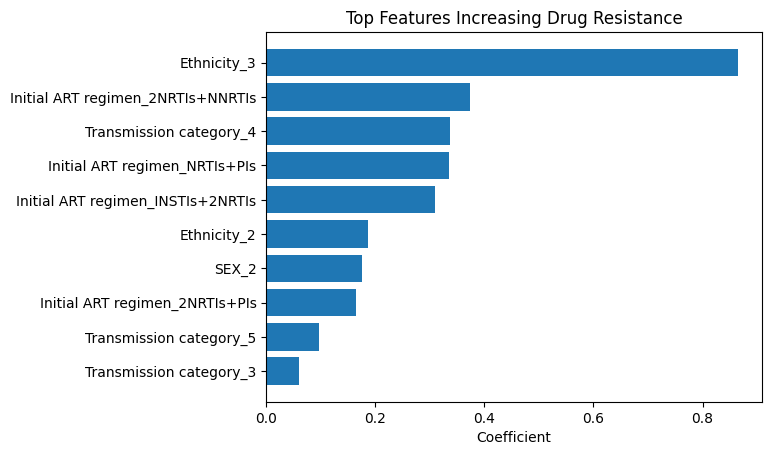
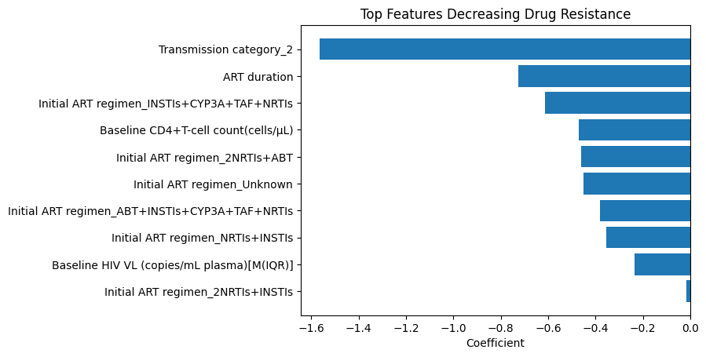
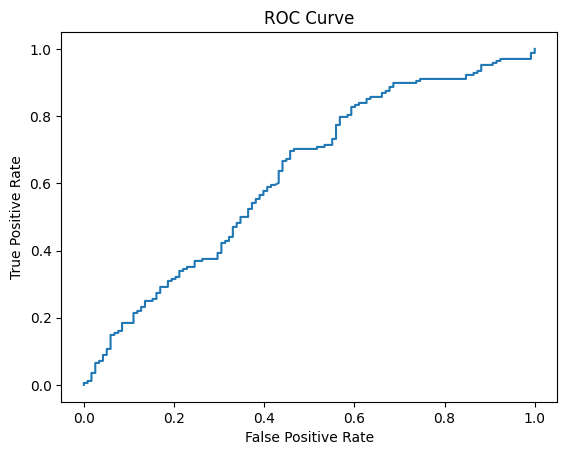
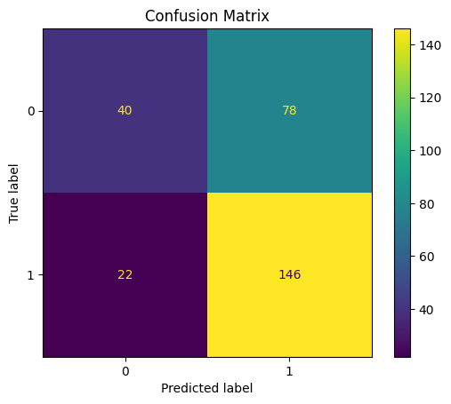

# Predicting HIV Drug Resistance Using Clinical and Treatment Data

## Overview
This project applies machine learning techniques to clinical and treatment data from HIV patients experiencing antiretroviral therapy (ART) failure to identify factors associated with drug resistance. Understanding these predictors can support clinical decision-making and highlight the limitations of using non-genetic data for resistance prediction.

## Objective
To determine whether baseline clinical, demographic, and treatment-related variables can predict the presence of HIV drug resistance in patients with ART failure.

## Dataset
The dataset originates from a retrospective cohort of HIV patients with confirmed virological failure (viral load >1000 copies/mL). It includes:

- Demographics: sex, ethnicity, transmission category  
- Clinical variables: CD4 count, viral load  
- Treatment variables: initial ART regimen, ART duration  
- Drug resistance outcomes derived from phenotypic susceptibility results  

## Methods

### Data Preprocessing
- Cleaned and standardized categorical variables  
- Handled missing data using:
  - Median imputation (numerical variables)  
  - "Unknown" category (categorical variables)  
- Converted categorical variables using one-hot encoding  
- Scaled numerical features using standardization  

### Modeling
- Logistic Regression model  
- Stratified train-test split (80/20)  

### Evaluation Metrics
- Accuracy  
- Precision  
- Recall  
- F1-score  
- ROC-AUC  

## Results

- Accuracy: 65%  
- ROC-AUC: ~0.63  

### Performance Insights
- High recall for resistant patients (87%)  
- Lower recall for non-resistant patients (34%)  
- Model shows moderate ability to distinguish resistance  

## Key Findings

- Certain ART regimens (e.g., NNRTI- and PI-based combinations) were associated with increased resistance risk  
- Higher CD4 counts were associated with lower resistance probability  
- Longer ART duration was associated with reduced resistance risk  
- Demographic variables showed associations but likely reflect confounding factors  

## Visualizations

- ### Features Increasing Resistance

### Features Decreasing Resistance

 
- ### ROC curve  

- ### Confusion matrix  

##  Limitations

- No genotypic (mutation-level) data included  
- Moderate model performance  
- Observational dataset with potential confounding  
- Cannot infer causality from associations  

## Conclusion

The model demonstrates that clinical and treatment variables provide some predictive signal for HIV drug resistance but are insufficient on their own. Drug resistance is fundamentally driven by viral genetic mutations, which were not included in this analysis.

## Future Work

- Incorporate genotypic resistance data  
- Explore advanced models (e.g., Random Forest, XGBoost)  
- Perform external validation on independent datasets  
- Develop risk scoring tools for clinical use  

## Tools & Technologies

- Python  
- pandas  
- scikit-learn  
- matplotlib  

